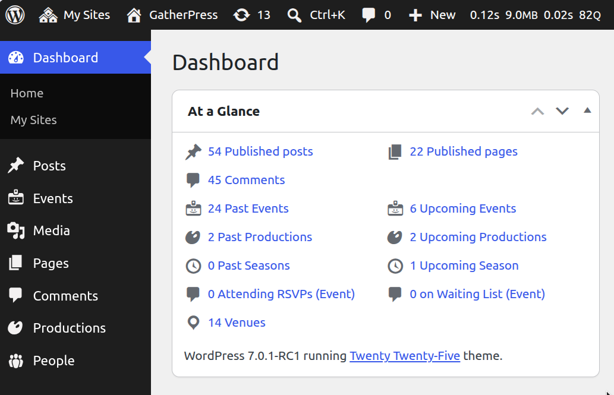

# GatherPress At a Glance

**Contributors:** carstenbach  
**Tags:** gatherpress, dashboard  
**Tested up to:** 7.1  
**Stable tag:** 0.1.1  
**License:** GPLv2 or later  
**License URI:** https://www.gnu.org/licenses/gpl-2.0.html  

 

## Description

Adds event, venue, and RSVP counts to the WordPress "At a Glance" dashboard widget — one row per post type for every GatherPress post-type-support group.

### What it does

**Event-date post types (`gatherpress-event-date`)**  
For each post type declaring `gatherpress-event-date` support, two rows are added: *Upcoming* and *Past*, delegating date filtering to GatherPress core's own `Event\Query` via the `gatherpress_event_query` WP_Query var.

**Venue post types (`gatherpress-venue-information`)**  
For each post type declaring `gatherpress-venue-information` support, one row shows the total published count.

<!--
**Topic taxonomy (`gatherpress_topic`)**  
One row shows the total number of topic terms.
-->

**RSVP post types (`gatherpress-rsvp`)**  
For each post type declaring `gatherpress-rsvp` support, two rows are added: *Attending RSVPs* and *on Waiting List*, counted via `Rsvp\Query::get_rsvps()` with a `tax_query` on `_gatherpress_rsvp_status`.

**Capability-gated links**  
Each count links to the relevant admin screen when the current user has the required capability (`edit_posts` for events/venues, `manage_terms` for topics, `moderate_comments` for RSVPs). When the capability is absent the count is shown as plain text without a link.

## Requirements

- WordPress 7.0 or later
- PHP 7.4 or later
- [GatherPress](https://gatherpress.org/) 0.35.2 or later

## Installation

1. Upload the plugin files to `/wp-content/plugins/gatherpress-at-a-glance`.
2. Activate the plugin via the **Plugins** screen.

## Frequently Asked Questions

### Does this work without GatherPress?

No.

### Will companion-plugin post types (Productions, Seasons, Groups) appear?

Yes — any post type that declares `gatherpress-event-date`, `gatherpress-venue-information`, or `gatherpress-rsvp` support will automatically appear, regardless of which plugin registered it.

## Changelog

All notable changes to this project will be documented in the [CHANGELOG.md](CHANGELOG.md).

## License

This plugin is licensed under the [GPLv2 or later](https://www.gnu.org/licenses/gpl-2.0.html).
